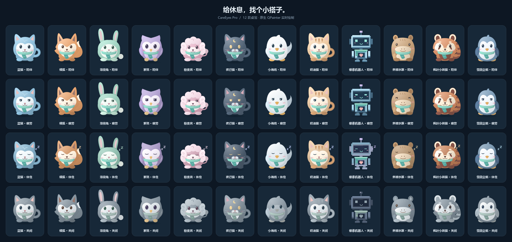
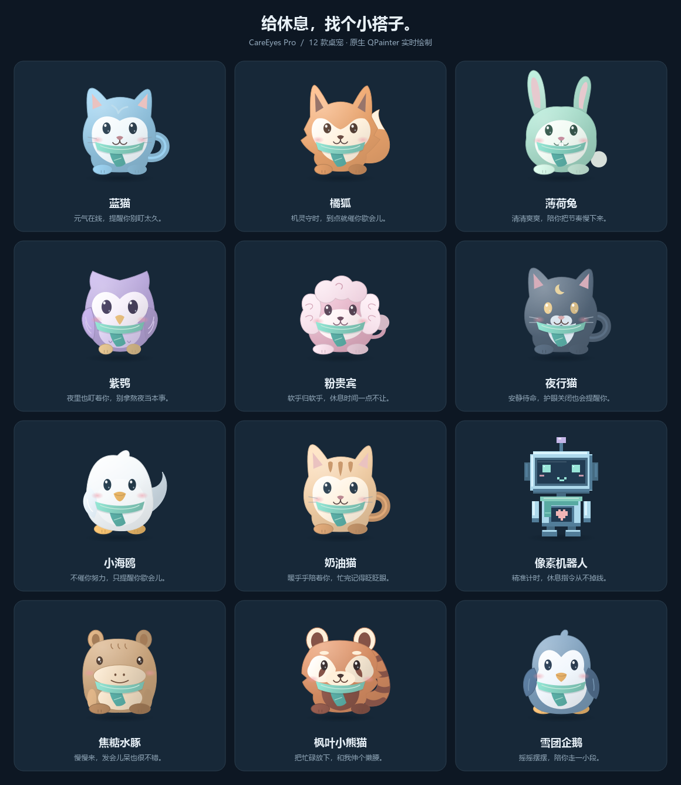
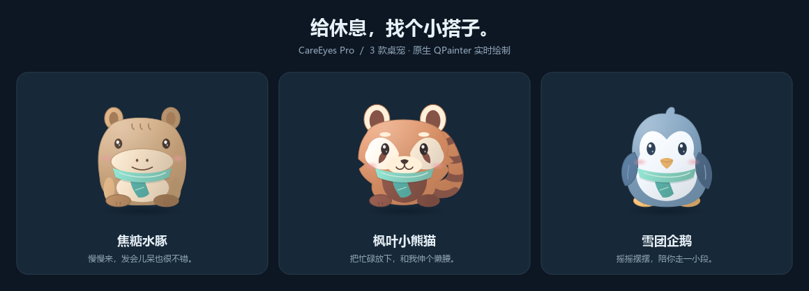
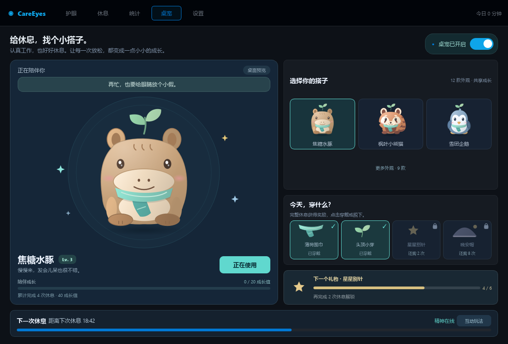

# CareEyes Pro

CareEyes Pro 是一款面向 Windows 的轻量护眼工具。它把屏幕色温、亮度、休息提醒、用眼统计、独立桌宠中心和系统托盘放在一个紧凑界面里，适合长时间写代码、办公或学习时后台运行。

当前主程序版本：`v5.5`

## 功能概览

- 色温调节：支持 `2000K` 到 `8000K`，通过 Gamma 曲线降低冷光刺激。
- 亮度调节：支持常规亮度和“超暗模式”，夜间使用更舒服。
- 昼夜自动模式：按时间自动调整目标色温。
- 休息提醒：可配置工作时长、休息时长，支持强制休息。
- 临时免打扰：可暂缓提醒 15 / 30 / 60 分钟，不关闭护眼、不丢失用眼统计。
- 全屏检测：检测到全屏应用时，会把休息提醒顺延 5 分钟。
- 用眼统计：展示今日用眼、休息次数、连续用眼和近 7 天趋势。
- 统计导出：将最近 32 个自然日内已有的用眼记录导出为 CSV，支持 Excel 直接打开。
- 独立桌宠中心：动态大预览、12 款形象、组合换装、陪伴等级、奖励解锁、休息进度和 5 种互动玩法。
- 系统托盘：关闭主窗口后继续后台运行，可从托盘恢复、切换护眼或退出。
- 多显示器支持：对多个显示器应用 Gamma 设置，并在退出时尝试恢复原始曲线。
- 单实例保护：重复启动时会唤起已运行实例，避免多个进程互相覆盖显示设置。

## v5.5 新增功能

### 临时免打扰

在“休息”页点击“免打扰”，或右键托盘图标选择“暂缓休息提醒”，可选择 **15 / 30 / 60 分钟**。

- 只屏蔽自动休息弹窗和提前一分钟的预告，色温、亮度和用眼统计照常工作。
- 页面显示剩余免打扰时间，可随时点击“恢复提醒”；页面和托盘的状态同步。
- 工作倒计时仍继续，到期自动恢复提醒；如果工作时间已经用完，会在下一次活动检测时提醒，不会额外重置一个工作周期。
- 锁屏、休眠或空闲时，仍按原有逻辑暂停用眼统计，但免打扰截止时间不延长。
- 手动开始休息和重置设置会取消免打扰；退出后不保存临时截止时间，重启后正常提醒。

### 用眼记录导出

在“统计”页点击“导出 CSV”，选择保存位置即可。导出包含当天最新统计以及保留范围内已有的历史记录：

```csv
date,usage_minutes
2026-09-19,120
2026-09-20,45
```

文件使用 UTF-8 BOM，字段分别为日期和用眼分钟数；按日期排序，不为缺失日期编造记录，也不把休息启动次数当作完成次数导出。取消保存不会写文件，写入失败会在页面显示原因。

本轮还修复了色温渐变在事件循环延迟后的拖长与快速切换跳变，并让配置保存失败显示在“设置”页。完整调研、实现取舍及后续功能优先级见 [优化与功能调研](docs/IMPROVEMENTS.md)。

## 界面预览

| 护眼控制 | 休息提醒 |
| --- | --- |
|  |  |

| 用眼统计 | 设置 |
| --- | --- |
|  |  |

桌宠中心的设计参考与状态示意：




概念图用于确定小海鸥、奶油猫和像素机器人的视觉方向；程序中的桌宠由 `QPainter` 实时绘制，不依赖额外图片资源。

## 桌宠中心

桌宠是顶部导航中的独立功能页，不再放在“设置”页里。启动程序后点击顶部的“桌宠”即可打开桌宠中心：

- 左侧是动态大预览、等级与成长条，右侧是外观、衣柜和下一件奖励；焦糖水豚、枫叶小熊猫、雪团企鹅直接展示，其余九款可通过“更多外观”展开。
- 点击皮肤卡片会立即替换桌面上的悬浮桌宠，并保存为下次启动的默认外观。
- 页面右上角或预览下方的开关可以独立显示/隐藏桌宠；该状态会和系统托盘菜单同步。
- 底部显示当前情绪、休息倒计时与进度；“互动玩法”可展开原有玩法和小彩蛋。较小窗口可纵向滚动，控件不会被裁掉。

当前可选外观：

十二款桌宠采用低饱和配色、柔和渐变和独立轮廓；以下图片直接由程序中的绘制代码生成，并非概念图：



| 外观 | 特点 |
| --- | --- |
| 蓝猫 | 雾蓝毛色、心形白脸、猫耳和卷尾，带柔和高光与小爪细节 |
| 橘狐 | 暖杏毛色、尖耳、蓬松脸颊与白尖大尾巴 |
| 薄荷兔 | 奶绿毛色、不对称长耳、绒球尾巴和小门牙 |
| 紫鸮 | 淡紫羽毛、心形面盘与羽纹，疲劳和休息时会半闭眼或闭眼 |
| 粉贵宾 | 豆沙粉卷毛、蓬松垂耳与毛球尾巴 |
| 夜行猫 | 灰蓝毛色、月牙额纹、琥珀色眼睛和白色小围脖 |
| 小海鸥 | 珍珠白柔光身体、小翅膀、头顶翘毛和暖黄色小脚 |
| 奶油猫 | 奶油毛色、额头条纹、粉色耳朵与弯尾 |
| 像素机器人 | 阶梯轮廓、机身高光和像素表情，配饰不会遮住心形指示灯 |
| 焦糖水豚 | 焦糖毛色、小圆耳、宽鼻吻与短爪，安静陪伴的慢节奏伙伴 |
| 枫叶小熊猫 | 枫糖毛色、奶白面罩、泪痕与会轻摆的环纹蓬松尾巴 |
| 雪团企鹅 | 雾蓝羽毛、心形白肚、摆动的小鳍与暖黄色鸟喙和脚掌 |

三款新皮肤无需解锁，直接在桌宠中心首屏选择。切换会沿用当前成长等级、服装与互动玩法，不重置休息倒计时，也不改变桌宠显隐和护眼设置；原有九款皮肤和存档继续可用。



所有外观都支持眨眼、视线跟随和状态表情，挠痒痒与开心彩蛋会切换笑眼。围巾适配各角色的身体比例，机器人使用像素化配饰；捏压、拉伸和抛掷时会自动限制绘制范围，避免耳朵或尾巴被窗口裁切。

桌面悬浮宠物默认使用“自由移动”：左键拖动即可调整位置并自动贴边。另提供“捏一捏 / 拉长长 / 挠痒痒 / 抛一下 / 轻戳”五种互动玩法；选择互动玩法后，普通左键按住或拖动可触发软体拉伸、抖动、回弹、粒子和抛掷，`Shift + 拖动`仍可移动桌宠。双击触发随机小彩蛋，`Ctrl + 双击`打开主界面；右键菜单和桌宠中心都可以切换玩法，选择会保存到配置。关闭主窗口后，桌宠和托盘仍可继续后台运行。

## 服装与陪伴等级



上图由实际 UI 生成，使用隔离的示例进度（完成 4 次休息、Lv.3），不修改用户存档。

- 每次完整结束休息获得 **10 成长值**，每 **20 成长值升一级**；从 Lv.1 开始，例如完成 4 次休息是 Lv.3。
- 等级和奖励按累计完整休息次数计算，跨日期、重启和切换宠物都会保留。旧版本未记录完成结果，因此不把历史“休息次数”直接兑换为成长值。
- 跳过、提前关闭、重置设置或退出程序取消的休息不计成长；同一次休息不会重复结算。
- 初始同时穿戴围巾和小芽。点击已穿戴服装可脱下；围巾、头饰、别针可组合，头顶小芽和晚安帽互斥。
- 衣柜、悬浮桌宠和所有外观预览实时同步，换装及休息奖励立即保存。新奖励解锁后由用户自行选择穿戴。

| 服装 | 解锁条件 | 穿戴位置 |
| --- | --- | --- |
| 薄荷围巾 | 初始可用 | 颈部 |
| 头顶小芽 | 初始可用 | 头部 |
| 星星别针 | 累计完整休息 6 次 | 别针 |
| 晚安帽 | 累计完整休息 12 次 | 头部，与小芽二选一 |

“重置所有设置”也会清空陪伴成长并恢复初始服装。衣柜解锁与等级不需要联网，不新增运行依赖。

生成实际界面预览（使用临时配置，不控制真实屏幕色温）：

```powershell
python docs/previews/render_pet_studio.py --pet-kind capybara --rests 4
python docs/previews/render_pet_studio.py --pet-kind red_panda --rests 12 --outfit scarf star_pin night_cap --output tmp/pet-studio-unlocked.png
python docs/previews/render_pet_studio.py --pet-kind penguin --width 760 --height 560 --more-skins --output tmp/pet-studio-compact.png
```

## 后台资源管理

- 隐藏桌宠时停止动画、聊天和气泡定时器，重新显示时恢复；隐藏期间的新气泡消息等待桌宠显示后再计时。
- 桌宠中心的大预览仅在页面可见时播放，切换页面、隐藏或最小化主窗口时暂停；皮肤卡片保持静态预览。
- 系统状态仅在统计页可见时采样；重新打开页面会立即刷新，并重置 CPU 采样基线，避免把隐藏期间计入当前负载。
- 护眼守护、休息倒计时和用眼统计仍按原规则在后台运行，不随主窗口隐藏而停止。
- Gamma 曲线使用最多 32 项的不可变结果缓存，减少重复计算，但每次护眼守护仍实际写入显示器，退出时仍恢复原始曲线。

## 快速开始

### 环境要求

- Windows 10 或 Windows 11
- Python 3.10+
- 支持 `SetDeviceGammaRamp` 的显卡驱动和桌面环境

### 安装依赖

```powershell
pip install -r requirements.txt
```

依赖很少：

- `PyQt5`：主界面、托盘、休息遮罩和桌面宠物。
- `pynput`：全局快捷键。该依赖不可用时，主程序仍可启动，只是快捷键功能会降级。

### 运行程序

```powershell
python mainpro.py
```

首次启动后，主窗口默认显示护眼控制页；需要管理桌宠时，直接点击顶部“桌宠”导航。桌宠页的启停和皮肤选择不会改变色温、亮度或休息规则，它们只控制桌宠本身。

如果护眼效果对部分管理员权限程序无效，可以右键终端或打包后的 EXE，选择“以管理员身份运行”。部分独占全屏程序、显卡控制面板或驱动更新也可能覆盖 Gamma 设置。

## 快捷键

| 快捷键 | 操作 |
| --- | --- |
| `Ctrl + Alt + Up` | 亮度增加 5% |
| `Ctrl + Alt + Down` | 亮度降低 5% |
| `Ctrl + Alt + Right` | 色温增加 200K |
| `Ctrl + Alt + Left` | 色温降低 200K |
| `Ctrl + Alt + End` | 切换护眼开关 |

## 测试

```powershell
python -m unittest discover -s tests -v
```

当前包含 143 项测试，覆盖 Gamma 恢复、单实例保护、休息调度、免打扰与统计独立性、CSV 导出、原子写入失败、渐变延迟/连续切换、启动清理、桌宠独立页面、12 款皮肤的状态/配饰渲染、眨眼与视线跟随、互动裁切保护、缩略图/高 DPI 缩放，以及新皮肤的选择持久化、成长保留、独立轮廓和小窗口滚动选择。

生成桌宠实际效果图（离屏绘制，不启动护眼效果、不读取用户配置）：

```powershell
python docs/previews/render_pet_gallery.py --output tmp/pet-gallery.png
python docs/previews/render_pet_gallery.py --states --output tmp/pet-states.png
python docs/previews/render_pet_gallery.py --kinds capybara red_panda penguin --output tmp/pet-new-skins.png
python docs/previews/render_pet_gallery.py --kinds capybara red_panda penguin --states --outfit scarf star_pin night_cap --output tmp/pet-new-outfits.png
```

## 打包

项目提供了 PyInstaller 构建脚本：

```powershell
pip install pyinstaller
powershell -ExecutionPolicy Bypass -File .\build.ps1
```

构建完成后，产物位于：

```text
dist\CareEyesPro.exe
```

脚本会同时生成 `CareEyesPro.exe.sha256`，用于校验发布文件。

## 配置文件

用户配置保存在：

```text
C:\Users\<用户名>\.care_eyes_pro.json
```

主要字段示例：

```json
{
  "temp": 5000,
  "bright": 1.0,
  "is_enabled": true,
  "rest_interval": 45,
  "rest_duration": 20,
  "force_rest": false,
  "auto_mode": false,
  "autostart": false,
  "super_dim": false,
  "super_dim_alpha": 80,
  "sound_enabled": true,
  "pet_enabled": true,
  "pet_kind": "blue_cat",
  "pet_interaction_mode": "move",
  "pet_completed_rests": 0,
  "pet_outfit": ["scarf", "sprout"],
  "pet_pos": []
}
```

`pet_kind` 可选值：`blue_cat`、`orange_fox`、`mint_bunny`、`purple_owl`、`pink_poodle`、`charcoal_cat`、`seagull`、`cream_cat`、`pixel_robot`、`capybara`、`red_panda`、`penguin`。

其中 `pet_enabled` 控制桌面悬浮宠物是否显示，`pet_kind` 控制当前皮肤，`pet_interaction_mode` 控制互动玩法，`pet_pos` 保存桌宠最后一次移动后的位置。推荐在桌宠中心修改这些选项，不需要手动编辑配置文件。

`pet_completed_rests` 保存累计完整休息次数，等级与解锁状态由它推导；`pet_outfit` 保存穿戴列表，空列表表示全部脱下。读取时会移除未知或尚未解锁的服装，并处理头饰冲突。

程序使用 Qt 的 `QSaveFile` 先写临时文件、再原子提交；禁止回退到直接覆盖原文件。打开、写入或提交失败时会保留旧配置，并在“设置”页显示错误，后续保存成功后清除提示。需要恢复默认设置时，退出程序后删除该文件，再重新启动即可。

## 项目结构

```text
mainpro.py                  主程序、界面、托盘、桌宠和业务逻辑
careeyes_runtime.py         Windows API、工作计时与桌宠成长/装备规则
tests/                      unittest 自动化测试
docs/images/                README 使用的界面截图和宠物图片
docs/previews/              预览图生成脚本
build.ps1                   PyInstaller 构建入口
CareEyesPro.spec            PyInstaller 配置
requirements.txt            Python 运行依赖
```

## 常见问题

### 退出后屏幕颜色没有恢复怎么办？

重新启动 CareEyes Pro，打开再关闭护眼开关，或从托盘正常退出。程序会在清理阶段尝试恢复启动时记录的 Gamma 曲线。

### 为什么快捷键没反应？

确认已经安装 `pynput`，并检查安全软件、键盘增强工具或其他全局快捷键程序是否占用了相同组合键。

### 为什么休息提醒被推迟？

程序检测到全屏应用时，会把本次休息顺延 5 分钟，避免在游戏、视频或演示时突然弹出遮罩。

### 桌宠不在“设置”页，在哪里切换？

点击顶部导航的“桌宠”进入独立桌宠中心。这里可以选择皮肤、查看动态预览、开关桌宠和查看休息倒计时；系统托盘右键菜单也可以快速显示或隐藏桌宠。

### 如何重置所有设置？

退出程序，删除 `C:\Users\<用户名>\.care_eyes_pro.json`，再启动 `mainpro.py` 或 EXE。

## 注意事项

CareEyes Pro 通过 Windows Gamma API 改变显示效果，不会修改显示器硬件配置。它适合辅助减少长时间看屏幕的不适，但不能替代医学诊断或治疗。
